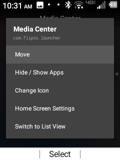
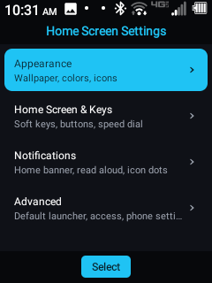

# Flip Launcher for Kyocera flip phones

A KaiOS-style Android Home screen for Kyocera keypad flip phones - the
DuraXV Extreme **E4810 / E4811** and the **E4610**. It's a fork of
[juliancruzsanchez/flip-launcher](https://github.com/juliancruzsanchez/flip-launcher),
by way of AmberIsCoding's rework, adapted to these phones and following the
house rules in
[Flip-DumbPhoneGuide](https://github.com/Ben-Showalter/Flip-DumbPhoneGuide/blob/main/AGENTS.md).

<p>
  
  
</p>

## Why this fork

The upstream launcher is a good KaiOS-style launcher, but it wasn't designed
for Kyocera phones and didn't support all of the Home screen shortcuts these
phones rely on - speed dial among them. Replacing Kyocera's own Home also
switches off several things Kyocera Home was quietly doing. This fork puts
them back:

- **Speed dial.** Hold a digit on Home to dial that speed-dial number (hold 1
  for voicemail). It reads the phone's own speed-dial list where it can; on
  the E4610, where that list can't be read, it uses the launcher's own slots
  under **Settings → Home Screen & Keys → Speed Dial**.
- **Call key** opens the phone's own call log, like it does under Kyocera Home.
- **Mic / Assistant key** works (it sends a different keycode depending on the
  model and what has focus) and opens the voice assistant by default.
- **Outer buttons** - SOS, outer END, outer Speaker and PTT. Their system
  setting only works under Kyocera Home, so the launcher lets you assign each
  one an app. A press opens it only while Home is showing, the screen is on and
  the phone is unlocked, so nothing happens in a pocket.
- **Kyocera's menus** - **Media Center**, **Tools** and **Quick Settings** -
  are in the app list, and can be pinned to a key like any other app.
- **Notifications on the E4810 / E4811.** Notification Access is blocked on
  these models, so the launcher can also use Accessibility to show new
  notifications on Home, put dots on app icons, and read messages aloud.
- **Keys behave consistently.** Every screen uses the same soft-key layout,
  actions fire when a key is released (so a press never spills into the next
  screen), and the phone's own soft-key label bar is hidden in favor of the
  launcher's.
- **Unknown buttons announce themselves.** Pressing a key the launcher doesn't
  recognize shows its keycode, so a new phone's buttons can be learned without
  a computer.

## Features

### Home

- A large clock and date, with the newest notification as a banner underneath.
- **Left / Right soft keys** open an app each (Contacts and Messages by
  default). **Center / OK** opens the app list; hold it for Settings.
- Each **D-pad direction** opens an app, shown as icons around the center key.
- Type a digit to open the dialer prefilled; hold a digit for speed dial.
- **Call** opens the call log; **Camera**, **Mic** and the outer buttons open
  their assigned apps.
- Hold any assignable key for 5 seconds to pick its app on the spot.

### App list

<p>
  
</p>

- Grid view (3x3 pages, opening on the center icon, number keys 1-9 launch the
  matching icon) or list view.
- Default order: Contacts, Notices, Messaging, Gallery, Media Center, Notepad,
  Quick Settings, Settings, Tools (whichever the phone has), then everything
  else A-Z.
- Dots on the icons of apps with unread notifications.
- **Options** on any app: **Move**, **Hide / Show Apps**, **Change Icon**
  (from an icon pack, the launcher's bundled set, or back to the original),
  **Home Screen Settings**, **Switch to List / Grid View**.
- The **Settings** entry asks whether you want **Phone Settings** or **Home
  Screen Settings**, with a **Don't ask again** option.

### Notices

A notification list sized for a small screen, standing in for the system
shade: icon, title, text and time for each one. **Left** dismisses the focused
notice, **Center** opens it, and **Options → Dismiss All** clears them all.
Needs Notification Access (not available on the E4810 / E4811).

### Read Aloud

New messages shown on Home can be read aloud - never, always, or only when a
Bluetooth headset is connected - with a choice of voice and speed. Any button
on the phone, or a headset's pause/play button, stops the reading (and does
nothing else); volume keys still change the volume.

### Settings

<p>
  
</p>

A short list where each row opens its own screen:

- **Appearance** - wallpaper, accent color, light/dark theme, icon pack, icon
  size
- **Home Screen & Keys** - soft keys and D-pad; other buttons (Camera, Mic,
  SOS, outer END, outer Speaker, PTT); speed dial
- **Notifications** - the Home banner, Read Aloud, icon dots
- **Advanced** - set as default launcher, Accessibility, Notification Access,
  Call Log Access, the Settings question, Phone Settings

### Look

- Built for 240x320 portrait screens and a keypad - no touch needed.
- The wallpaper is dimmed automatically according to how bright it is, so
  text and icons stay readable.
- Every icon is a squircle; icons without a background of their own sit on a
  dark gray tile. The focused icon gets a ring in its own color.
- No animations - every screen change is instant.

### Key map

| Key | Home | Other screens |
|---|---|---|
| Left soft key | Assignable app (Contacts) | Screen's main action |
| Center / OK | App list (hold: Settings) | Select |
| Right soft key | Assignable app (Messages) | Options |
| Menu | App list (hold: assignable app) | Options |
| Back / Clear | App list (hold: assignable app) | Back |
| Call | Phone's call log | Call the focused entry (Recent Calls) |
| 0-9, `*`, `#` | Dialer, prefilled; hold 2-9 / 0 for speed dial, 1 for voicemail | 1-9 launch apps on the grid page |
| D-pad | Assignable app per direction | Move focus |
| Camera / Mic | Assignable app (camera / voice assistant) | - |
| SOS / outer END / outer Speaker / PTT | Assigned app, only while Home is showing, the screen is on and the phone is unlocked | Left to the phone |

## Known limits

- **E4810 / E4811:** Notification Access appears to turn on but never works
  (a platform restriction), so Notices stays empty; turn on Accessibility for
  the Home banner, icon dots and Read Aloud.
- **Outer buttons** report only the press, not how long they're held, so they
  have no long-press action.
- Kyocera's internal screen names (call log, menus) were captured on the
  E4610; if one differs on another model, the launcher falls back or shows a
  message instead of crashing.
- After updating, turn Flip Launcher's Accessibility switch **off and on**
  once so new abilities (like stopping Read Aloud on any button) take effect.

## Installing

These phones have no Play Store, so the APK is sideloaded:

- **ADB:** `adb install -r app/build/outputs/apk/debug/app-debug.apk`, or
- **USB copy / email:** put the APK on the phone, open it from the Files app,
  and allow installs from that source when asked.

On first start Home asks to become the default Home app, then to turn on
Accessibility. Everything else is under **Settings → Advanced**:

1. **Set as Default Launcher** - pick **Flip Launcher**.
2. **Accessibility** - turn on Flip Launcher (needed on the E4810 / E4811).
3. **Notification Access** - for Notices and the Home banner on phones where
   it works (e.g. the E4610).
4. **Call Log Access** - for Recent Calls. If it was denied before, the phone
   opens its app info: **Permissions → Call logs**.

## Building

```bash
./gradlew :app:assembleDebug
```

The debug APK lands in `app/build/outputs/apk/debug/`.

- Any JDK from 17 to 26 runs the build (Android Studio's bundled one is fine).
- An Android SDK with `platforms;android-36` and `build-tools;36.0.0`, found
  through `local.properties` (`sdk.dir=...`) or `ANDROID_HOME`.
- The phone needs Android 5.0 (API 21) or newer.

See [CONTRIBUTING.md](CONTRIBUTING.md) for a from-scratch setup.

## Permissions

- **Notification Access** (`BIND_NOTIFICATION_LISTENER_SERVICE`) - Notices,
  the Home banner and icon dots.
- **Accessibility service** - the notification fallback on the E4810 / E4811,
  and stopping Read Aloud on any button.
- **Call log** (`READ_CALL_LOG`) - Recent Calls; asked for only when you use it.
- `CALL_PHONE` - speed dial and voicemail place the call directly.
- `READ_CONTACTS` - picking a contact for a speed-dial slot.
- `SET_WALLPAPER` - the bundled wallpaper picker.

App enumeration uses a `<queries>` declaration rather than
`QUERY_ALL_PACKAGES`.
