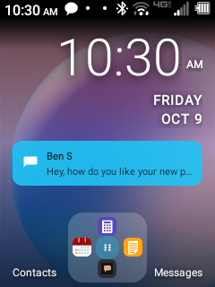
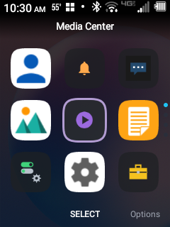
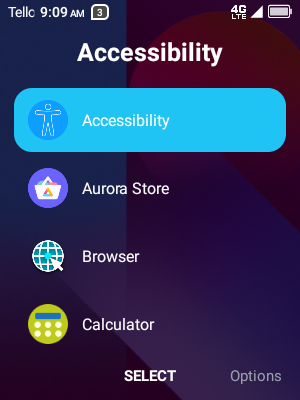
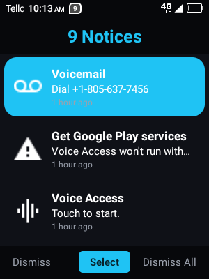

# Flip Launcher — a KaiOS-style Android launcher

A KaiOS-style Android launcher built for keypad flip phones (small,
low-resolution, D-pad/soft-key driven, no touchscreen) rather than touch-first
flagships. It's tested on the Kyocera DuraXV Extreme E4810 / E4811 and the
E4610, and follows the house rules in
[Flip-DumbPhoneGuide](https://github.com/Ben-Showalter/Flip-DumbPhoneGuide/blob/main/AGENTS.md).
Navigation leans on the physical soft keys and D-pad: number keys 1-9 double
as shortcuts everywhere they make sense, and every screen uses the same
soft-key layout - **Left** runs the screen's main action, **Center/OK**
selects, **Right** (or **Menu**) opens Options, and the **Back/Clear** key
goes back.



## Features

### Home screen

- A vertical rail of up to 9 shortcut icons on the left (mapped to number keys
  1-9, top to bottom). The disc size adapts to the screen so all five visible
  slots fit without clipping, even on a 240x320 display.
- A large clock and date on the right.
- Bottom soft keys: **Notices** (left), **All Apps** (center — press to open;
  long-press for **Settings**), and a configurable right key (Contacts by
  default).
- A notification summary (missed calls / messages / other) under the clock,
  each independently toggleable.
- Typing a digit anywhere on Home jumps straight into the dialer, prefilled.
- Long-pressing Back launches a configurable app.

### App Drawer ("All Apps")

- Every installed, non-hidden app, in **grid** or **list** view (toggle in
  **Settings → Apps & Drawer**):
  - **Grid**: a 3x3 icon page at a time, tracked by a column of dots on the
    right. Number keys 1-9 launch the matching icon on the current page, and
    the drawer opens with the center icon focused.
  - **List**: one continuous scroll, icon + label per row — no pages, no dots,
    just normal scrolling.
- Default order: Contacts, Notices, Messaging, Gallery, Media Center, Notepad,
  Quick Settings, Settings, Tools (whichever the phone has), then everything
  else A-Z. Move any app from its Options menu.
- Long-press (or the Options soft key) on any app to:
  - Add it to Home shortcuts
  - Hide it from the drawer
  - Change its icon (from an installed icon pack or the launcher's own bundled
    icon set)
  - Reset a per-app icon override
  - Uninstall it




- On Kyocera phones the drawer also lists **Media Center**, **Tools** and
  **Quick Settings**, which open Kyocera's own Home menus. They can be pinned
  to Home or a key like any other app, and are hidden on other phones.

### Notices

A custom notification list standing in for the system shade, which isn't
designed for a screen this small. Shows icon, title, body text and a relative
timestamp ("2 minutes ago", "8:30 AM", …) per notification.

- **Dismiss** (left soft key) — dismiss the focused notice
- **Select** (center) — open the notice's action, then dismiss it
- **Options** (right) — **Dismiss All** clears every active notification

Requires Notification Access, granted from **Settings → Notifications**.



### Settings

Everything lives in one **Settings** hub, so there's a single, followable place
for customization. Open it by long-pressing the center soft key on Home; it's
also listed in the app drawer like a normal app. Settings are grouped into
categories you drill into:

- **Appearance**
  - **Set Wallpaper** — pick from bundled wallpapers or the system chooser
  - **Accent Color** — cyan (default), red, orange, yellow, green, blue,
    indigo, violet — applied to focus highlights, page dots, toggles, and other
    accents throughout the launcher
  - **Icon Shape** — squircle, square, rounded square, circle, or none;
    adaptive icons are masked into the shape, legacy icons get an optional
    tinted background disc
  - **Icon Pack** — apply any installed icon pack (Nova/ADW/Apex-compatible)
    launcher-wide
  - **App Icon Size** — small / medium / large
  - **Background for Plain Icons** — toggle the synthesized tint disc for
    non-adaptive icons
  - **Animations** (Motion) — fast, lightweight transitions are on by default;
    turn them off to make navigation instant on the slowest hardware
- **Notifications**
  - **Notification Access** — grants/checks the permission that powers Notices
    and the Home badges
  - **Show Missed Calls / Messages / Other Notifications** — independent
    toggles for the Home badge summary
  - **Notification Dots on Icons** — small dot over app icons with pending
    notifications
- **Home Screen & Keys**
  - **Home Left Key / Home Right Key** — assign an app to either soft key, or
    leave them as Notices / Contacts
  - **Back Button (Long-Press)** — assign an app to launch on long-press Back
  - **Customize Home Shortcuts** — see below
- **Apps & Drawer**
  - **App Drawer View** — Grid or List
  - **Hide / Show Apps** — see below
- **System**
  - **Set as Default Launcher**
  - **System Settings**

Rows are designed to read clearly on a small screen: section headers group
related settings, On/Off toggles show a switch-style pill, and rows that open
another screen or chooser show a chevron.

#### Home Shortcuts

Customize the ordered list of up to 9 Home rail shortcuts. Pick a shortcut row
(or its number key) to reassign it, including pinning a specific *activity*
inside an app rather than just its main entry point. The trailing "Add
shortcut" row appends a new one; the Clear soft key removes the focused
shortcut.

#### Hide / Show Apps

Lists every installed app with a "Hidden" badge; Center/OK toggles whether the
focused app is hidden from Home and the App Drawer.

#### Icon packs & built-in icons

- Apply any installed icon-pack app launcher-wide from **Settings → Appearance
  → Icon Pack**.
- Override a single app's icon independently of the active pack, choosing from
  that pack's full icon set or from the launcher's own bundled icon collection
  — so there's always something to pick from even with no icon pack installed.

### Key map

| Key | Home | List screens / App Drawer |
|---|---|---|
| Left soft key | Notices (assignable) | Screen's main action (e.g. Dismiss) |
| Center / OK | All Apps (hold: Settings) | Select the focused row |
| Right soft key | Contacts (assignable) | Options |
| Menu | All Apps (hold: assignable app) | Options |
| Back / Clear | All Apps (hold: assignable app) | Back |
| Call | The phone's own call log (falls back to the launcher's Recent Calls) | Call the focused entry (Recent Calls) |
| 0-9, `*`, `#` | Open the dialer prefilled; hold 0/2-9 for speed dial (the phone's, or the launcher's own under **Settings → Home Keys → Speed Dial**), 1 for voicemail | 1-9 launch the matching app on the drawer's grid page |
| D-pad | Assignable app per direction | Move focus |
| Camera / Mic (Assistant) | Assignable app (by default Camera opens the camera, Mic the voice assistant) | - |
| SOS / outer END / outer Speaker / PTT | Press to open the assigned app - only while Home is showing with the screen on and the flip open, so pocket presses do nothing; unassigned, the phone's own button setting applies | Left to the phone |

Hold any assignable Home key for 5 seconds to pick its app on the spot. Keys
the launcher doesn't recognize show a short "Unrecognized key" toast with
their keycode, so you can learn a new phone's buttons without a computer.

## Built for small, non-touch screens

- Tuned for QVGA (~240x320) portrait displays driven by a D-pad, soft keys, and
  a number pad — no touch required.
- A shared design-token system (typography, spacing, corner radii) keeps every
  screen consistent and easy to retune.
- Focus highlights follow the chosen accent color, and animations are kept
  short and cheap (alpha/scale only) so they stay smooth on weak chipsets — and
  can be turned off entirely.
- The phone's own soft-key label bar (the system navigation bar) is hidden on
  every screen in favor of the launcher's own labelled bar.

## Requirements

- Android 5.0 (API 21) or newer on the device.
- An Android SDK with `platforms;android-36` and `build-tools;36.0.0` (point
  the build at it via `local.properties` or `ANDROID_HOME`).
- A JDK is **not** something you need to install or configure — the Gradle
  toolchain auto-provisions JDK 17 for the build. Gradle itself runs on any
  JDK 17-26.

See [CONTRIBUTING.md](CONTRIBUTING.md) for a from-scratch environment setup.

## Building

```bash
./gradlew :app:assembleDebug
```

The debug APK lands in `app/build/outputs/apk/debug/`.

## Installing

These phones have no Play Store, so the APK is sideloaded. Either:

- **ADB:** `adb install -r app/build/outputs/apk/debug/app-debug.apk`, or
- **USB copy / email:** put the APK on the phone, open it from the Files app,
  and allow installs from that source when asked.

Then, all with the D-pad:

1. **Make it the Home app:** open Flip Launcher, hold **Center/OK** for
   Settings, select **Set as Default Launcher**, pick **Flip Launcher** and
   press OK.
2. **Notification Access** (Notices + Home badges): **Settings →
   Notifications → Notification Access**, select **Flip Launcher** and turn it
   on. On the Kyocera E4810/E4811 this access never takes effect (a platform
   restriction), so also turn on **Accessibility Fallback Access** from the same screen,
   which feeds the Home banner instead.
3. **Call Log access** (Recent Calls): **Settings → Notifications → Call Log
   Access**, then allow it. If it was denied before, the phone opens its Apps
   list: select **Flip Launcher → Permissions** and turn on Call logs.

## Permissions

- `BIND_NOTIFICATION_LISTENER_SERVICE` (via Notification Access, granted by the
  user in system settings) — powers Notices and the Home badge summary.
- `SET_WALLPAPER` — used by the bundled wallpaper picker.

No runtime permissions are requested at launch. App enumeration uses a
`<queries>` declaration rather than `QUERY_ALL_PACKAGES`.
